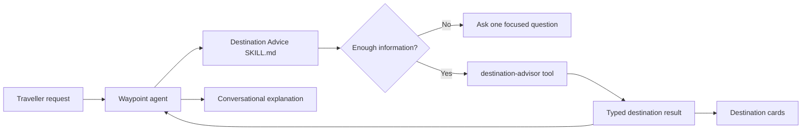
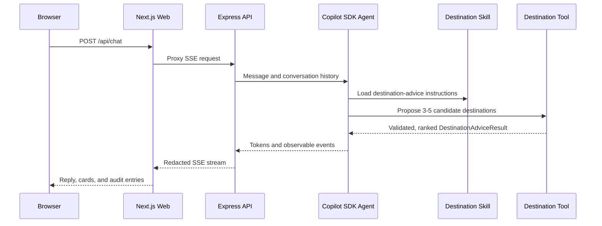

# Waypoint Demo Guide

## Demo Story

Waypoint is a deployed holiday-planning agent that separates three concerns:

1. **Skills** give the agent reusable procedural expertise in Markdown.
2. **Tools** perform trusted, typed, deterministic operations in TypeScript.
3. **The agent runtime** decides when to apply a skill and invoke its tools.

The destination-advice flow is the clearest example. The Markdown skill teaches
the agent how to interview a traveller and present recommendations. The agent
proposes candidate destinations from its own broad travel knowledge, and the
`destination-advisor` tool validates, de-duplicates, ranks, and canonicalizes
those candidates into structured results that the Web application safely renders
as destination cards. A deterministic pool guarantees a valid shortlist when the
agent proposes too few.



## Suggested Talk Track

### 1. Start With The Deployed Experience

Open the deployed Web application and enter:

> I love warm weather, hiking, and good seafood.

Point out:

- The response is streamed from the agent.
- The destination cards are structured UI, not parsed model prose.
- Every destination has a canonical place name, rationale, and tags.
- The Audit panel exposes decisions and tool activity without exposing hidden
  model reasoning.

Then refine the result:

> Make it cheaper and more beach-focused.

Explain that the prior conversation is supplied to the tool so refinement
updates the shortlist instead of starting over.

### 2. Show The Product Contract

Open `specs/frd-destination-advice.md`.

Explain that the repository is specification-driven:

- FRD-003 defines the traveller experience.
- `specs/features/destination-advice.feature` expresses it as approved Gherkin.
- Tests are generated before implementation and serve as proof of completion.
- The implementation must preserve canonical names for later weather and
  booking increments.

### 3. Show The Runtime Skill

Open `src/api/src/agent/skills/destination-advice/SKILL.md`.

Describe this as the agent's reusable procedural knowledge:

- when destination advice applies;
- what preferences to collect;
- when to ask a clarification;
- when to call the destination tool;
- how to ground the response in tool output;
- what the model must not invent.

This file follows the standard skill package format: YAML frontmatter for
discovery and concise Markdown instructions loaded only when the skill is used.

### 4. Show The Trusted Tool

Open `src/api/src/tools/destination-advisor.ts`.

Explain that the tool owns low-variance behavior that should not depend on
model interpretation:

- Zod validation of the agent's proposed candidates;
- the SDK-facing JSON schema the agent fills in;
- canonical-name enforcement, de-duplication and ranking;
- deterministic clarification and edge-case handling;
- a keyword-matched fallback pool for reliability;
- structured result types and shortlist refinement.

The model proposes destinations from its broad knowledge; it does not manufacture
the card payload. Application code validates and ranks those candidates before
any of them reach the UI. Time-sensitive facts (live weather, prices,
availability) are deferred to the specialist tools in later increments.

### 5. Show Native Skill Loading

Open `src/api/src/agent/runtime-skills.ts`, then
`src/api/src/agent/copilot-driver.ts`.

Explain that the application uses native GitHub Copilot SDK skill support:

- `enableSkills` enables runtime skill loading.
- `skillDirectories` points at the application-owned skill packages.
- the `waypoint` custom agent preloads `destination-advice`.
- `tools` makes the deterministic `destination-advisor` capability available.
- the SDK reads `SKILL.md`; the application does not maintain a custom Markdown
  parser or concatenate untrusted files into prompts.

### 6. Show The Shared Contract And UI

Open these files in order:

1. `src/shared/types/destination-advice.ts` - request and result types.
2. `src/web/lib/useChat.ts` - consumes typed SSE tool results.
3. `src/web/app/page.tsx` - renders the destination list.
4. `src/shared/audit.ts` - maps observable events into audit entries.
5. `src/web/app/AuditPanel.tsx` - presents the audit trail.

The same structured result crosses the API, SSE stream, reducer, and UI. This
keeps the model-facing workflow flexible while preserving an explicit
application contract.

## Skill Versus Tool

| Concern | Markdown skill | TypeScript tool |
|---|---|---|
| Primary purpose | Reusable agent expertise and workflow | Trusted execution |
| Degree of freedom | Medium to high | Low |
| Interpreted by | Model/runtime | JavaScript runtime |
| Typical contents | Heuristics, sequencing, tool guidance | Validation, APIs, business rules |
| Output | Agent behavior and tool choice | Typed structured data |
| Testing | Loading/invocation contract and E2E behavior | Unit and integration tests |

The two layers complement each other. A Markdown-only implementation would make
the card data less predictable. A TypeScript-only implementation would
demonstrate tool calling but would not showcase reusable agent skills.

## Repository Structure

```text
waypoint-demo/
|- demo-guide.md                  Demo talk track and code navigation
|- specs/                         Product and behavioral source of truth
|  |- prd.md                      Product requirements
|  |- frd-*.md                    Feature requirements
|  |- features/                   Approved Gherkin scenarios
|  |- contracts/                  API and infrastructure contracts
|  |- ui/                         Screen map, design system, prototypes
|  `- adrs/                       Architecture decisions
|- src/
|  |- shared/                     Cross-application TypeScript contracts
|  |- api/
|  |  |- src/
|  |  |  |- agent/                Copilot SDK runtime and skill loading
|  |  |  |  `- skills/            Runtime Markdown skill packages
|  |  |  |- tools/                Executable tools exposed to the agent
|  |  |  |- session/              Conversation persistence
|  |  |  |- security/             Server-side redaction
|  |  |  `- validation/           API boundary validation
|  |  `- tests/                   API unit and integration tests
|  `- web/
|     |- app/                     Next.js UI and server-side API proxy
|     `- lib/                     Client-side chat stream state
|- tests/                         Cucumber step definitions and support
|- e2e/                           Playwright journeys and page objects
|- infra/                         Azure Container Apps Bicep
`- .spec2cloud/                   Workflow state and append-only audit log
```

## Request Flow



## Useful Demo Prompts

| Prompt | Behavior to highlight |
|---|---|
| `I love warm weather, hiking, and good seafood.` | Structured ranked shortlist |
| `Recommend somewhere.` | One clarification and no fabricated shortlist |
| `Make it cheaper and more beach-focused.` | Context-aware refinement |
| `I want hot weather and snowy beaches.` | Contradictory preference handling |
| `Find midnight sun, tropical coral reefs, and nearby skiing.` | Closest alternatives |
| `Can you review my tax return?` | Travel-domain redirect |

Foundry response latency varies. Allow the current turn to finish before sending
a refinement, then open the Audit panel to show the observable execution path.

## Key Design Message

> Waypoint uses Markdown skills for reusable agent expertise and TypeScript
> tools for trusted execution. The skill tells the agent how to conduct
> destination discovery; the tool validates inputs and returns UI-safe,
> structured recommendations.
