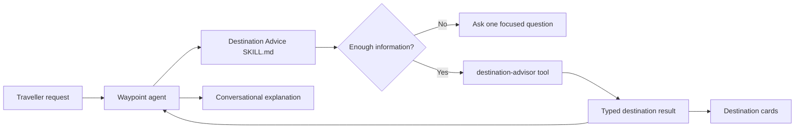
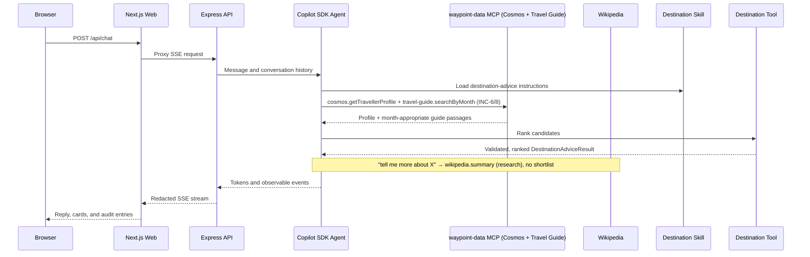

# Waypoint Demo Guide

## Demo Story

Waypoint is a deployed holiday-planning agent that separates three concerns:

1. **Skills** give the agent reusable procedural expertise in Markdown.
2. **Tools** perform trusted, typed, deterministic operations in TypeScript.
3. **The agent runtime** decides when to apply a skill and invoke its tools.

The destination-advice flow is the clearest example of skills + tools. The Markdown skill
teaches the agent how to interview a traveller and present recommendations; the
`destination-advisor` tool validates, de-duplicates, ranks and canonicalizes candidates
into structured results the Web app renders as cards.

> **Data-driven (INC-6 / INC-8, live):** recommendations are grounded in **real data** retrieved
> over real MCP calls — the traveller profile from **Azure Cosmos DB**
> (`cosmos.getTravellerProfile`) and a **travel-guide knowledge base** in **Azure AI
> Search** (`travel-guide.searchByMonth`) — both via the self-hosted `waypoint-data` MCP,
> with the agent reasoning over both. A **month-aware** request ("where should I go in June?")
> returns guide-grounded, personalised ideas that avoid recently-visited places. Asking to
> **"tell me more about"** a place triggers a **Wikipedia-backed research** answer. *(An offline
> deterministic profile + guide back tests and local runs.)*
>
> **Full journey:** destination advice → place research → weather & best time (Open-Meteo)
> → flights & hotels in GBP (RouteStack, **asks for dates first** if none given) → simulated
> booking → trip summary & budget (GBP / EUR). Every slow step streams a **live loading
> status** ("Searching the travel guide…", "Looking up weather data…", "Researching more into…").



## Suggested Talk Track

### 1. Start With The Deployed Experience

Open the deployed Web application and enter:

> I love warm weather, hiking, and good seafood.

Point out:

- The response is streamed from the agent.
- The destination cards are structured UI, not parsed model prose.
- Every destination has a canonical place name, rationale, and tags.
- The Audit panel exposes decisions and tool activity without exposing hidden
  model reasoning.

Then refine the result:

> Make it cheaper and more beach-focused.

Explain that the prior conversation is supplied to the tool so refinement
updates the shortlist instead of starting over.

### 1b. Walk The Full Journey (end-to-end UX)

Show the complete traveller experience, calling out the live loading status between turns:

1. **Discover** \u2014 `Where should I go in June?` \u2192 month-aware, guide-grounded shortlist (Azure AI Search) that reflects the profile and avoids past trips. *("Searching the travel guide for June recommendations\u2026")*
2. **Research** \u2014 `Tell me more about Lisbon.` \u2192 a rich, Wikipedia-grounded description (facts + travel tips), no shortlist. *("Researching more into Lisbon\u2026")*
3. **Time it** \u2014 `When is the best time to visit?` \u2192 Open-Meteo ERA5 normals, source-cited. *("Looking up weather data for Lisbon\u2026")*
4. **Search** \u2014 `Find flights and a hotel there from London.` \u2192 the agent **asks for your dates first**; provide them and it searches RouteStack, normalised to GBP, with the aisle seat + vegetarian meal pre-selected.
5. **Book** \u2014 `Book the first flight and the first hotel.` \u2192 a clearly-simulated confirmation with seat 23C and reward points, and the trip summary auto-appears above it.
6. **Total it** \u2014 `Show the total in euros.` \u2192 budget total converted live (rate + timestamp in the audit).

Open the **Audit panel** at any point: every step shows its decision, tool/MCP call and result \u2014 never the model's hidden reasoning.
### 1c. Observability — the agent's conversations & audit trail (agentic factory)

The agent is **hosted on Microsoft Foundry Agent Service**; the deployed **ACA web app**
routes every turn through it (option C) and emits a full **GenAI OpenTelemetry** audit trail
to the Application Insights linked to the Foundry project. Each web session maps to a Foundry
**conversation** (`conv_…`) so turns are threaded (they share `gen_ai.conversation.id`).

> **Where to show it — Application Insights (reliable).** The **Foundry portal → agent →
> Traces** tab is fed by the platform's *own* agent-server telemetry, which the hosted
> **sandbox drops** when it freezes CPU between requests — so that tab is best-effort in
> preview. The **complete, reliable** record is our own GenAI trace in the project's App
> Insights (`appi-dnszpz4hqfi7g`, workspace `log-dnszpz4hqfi7g`). Present it from **Azure
> portal → `appi-dnszpz4hqfi7g` → Logs** (or Log Analytics → the workspace → Logs).
> Ingestion lags ~10–15 min, so **chat a few minutes before** the recording.

**Step 1 — list the conversations (the "conversation view"):**

```kusto
AppDependencies
| where TimeGenerated > ago(24h)
| where Name == 'invoke_agent waypoint'
| extend P = parse_json(Properties)
| extend conversation = tostring(P['gen_ai.conversation.id']),
         user  = tostring(P['waypoint.user_message']),
         reply = tostring(P['waypoint.assistant_reply'])
| where isnotempty(conversation)
| summarize firstSeen = min(TimeGenerated) by conversation, user, reply   // collapse duplicate spans
| summarize turns = count(), started = min(firstSeen), lastActivity = max(firstSeen),
            arg_min(firstSeen, user) by conversation
| project conversation, turns, opening = user, started, lastActivity
| order by lastActivity desc
```

Copy the `conversation` id of the chat you just had.

**Step 2 — open the thread (the dialogue, turn by turn):**

```kusto
let convId = "conv_PASTE_ID_HERE";
AppDependencies
| where TimeGenerated > ago(24h)
| where Name == 'invoke_agent waypoint'
| extend P = parse_json(Properties)
| where tostring(P['gen_ai.conversation.id']) == convId
| extend user = tostring(P['waypoint.user_message']),
         assistant = tostring(P['waypoint.assistant_reply'])
| summarize turnTime = min(TimeGenerated) by user, assistant   // collapse duplicate spans
| order by turnTime asc
| project turnTime, user, assistant
```

**Step 3 — the full audit trail for that conversation (dialogue + every tool call, with content):**

```kusto
let convId = "conv_PASTE_ID_HERE";
let ops = AppDependencies
    | where TimeGenerated > ago(24h)
    | where Name == 'invoke_agent waypoint'
    | extend P = parse_json(Properties)
    | where tostring(P['gen_ai.conversation.id']) == convId
    | distinct OperationId;
AppTraces
| where OperationId in (ops)
| where Message startswith 'gen_ai'
| extend D = parse_json(Properties)
| extend tool = tostring(D['tool.name']), type = tostring(D['tool.type']), ok = tostring(D['tool.ok'])
| extend detail = case(
        Message in ('gen_ai.user.message', 'gen_ai.assistant.message'), tostring(D['content']),   // what the user / agent said
        Message == 'gen_ai.agent.decision', tostring(D['summary']),                                 // why the agent acted
        Message == 'gen_ai.tool.call',       tostring(D['tool.arguments']),                          // tool inputs
        Message == 'gen_ai.tool.result',     tostring(D['tool.result']),                             // tool output
        '')
| summarize TimeGenerated = min(TimeGenerated) by step = Message, tool, type, ok, detail   // collapse duplicate spans
| order by TimeGenerated asc
| project TimeGenerated, step, tool, type, ok, detail
```

This returns the observable orchestration for the thread **with the message content on every
step** — `gen_ai.user.message` / `gen_ai.assistant.message` show what the traveller and the
agent said; `gen_ai.agent.decision` shows the agent's stated reason; `gen_ai.tool.call` shows
the tool inputs and `gen_ai.tool.result` the tool output (wikipedia, copilot.chat, travel-search /
RouteStack, Open-Meteo, Cosmos, …) — never the model's hidden reasoning. It's the **same audit
trail** as the web panel, in the platform's management plane. (Add
`| extend detail = substring(detail, 0, 200)` if you want shorter cells for a table view.)

> **Presenting it cleanly:** pin Step 1–3 as tiles on an **Azure Dashboard**, or save them in
> an App Insights **Workbook** with `conversation` as a parameter, so a click drills from the
> conversation list into its turns and audit trail. The web app's **Audit panel** is the
> always-live, zero-lag version of the same story.
>
> Talk track: this is the **run → observe → govern** half of an *agentic factory* —
> planning/building via spec2cloud, running on Foundry Agent Service, observing via GenAI
> traces, and governing via evaluations
> ([FRD-008](specs/frd-agent-evaluation-and-quality.md)) and RBAC/content-safety/version gates
> ([FRD-009](specs/frd-governance-and-observability.md)). See
> [ADR-010](specs/adrs/adr-010-foundry-agent-service-hosting.md) / [ADR-011](specs/adrs/adr-011-otel-genai-traces.md).

### 2. Show The Product Contract

Open `specs/frd-destination-advice.md`.

Explain that the repository is specification-driven:

- FRD-003 defines the traveller experience.
- `specs/features/destination-advice.feature` expresses it as approved Gherkin.
- Tests are generated before implementation and serve as proof of completion.
- The implementation must preserve canonical names for later weather and
  booking increments.

### 3. Show The Runtime Skill

Open `src/api/src/agent/skills/destination-advice/SKILL.md`.

Describe this as the agent's reusable procedural knowledge:

- when destination advice applies;
- what preferences to collect;
- when to ask a clarification;
- when to call the destination tool;
- how to ground the response in tool output;
- what the model must not invent.

This file follows the standard skill package format: YAML frontmatter for
discovery and concise Markdown instructions loaded only when the skill is used.

### 4. Show The Trusted Tool

Open `src/api/src/tools/destination-advisor.ts`.

Explain that the tool owns low-variance behavior that should not depend on
model interpretation:

- Zod validation of the agent's proposed candidates;
- the SDK-facing JSON schema the agent fills in;
- canonical-name enforcement, de-duplication and ranking;
- deterministic clarification and edge-case handling;
- structured result types and shortlist refinement.

The model reasons over the retrieved data (Cosmos profile + travel-guide passages, INC-6/8);
application code validates and ranks candidates before any reach the UI. Time-sensitive
facts (live weather, prices, availability) are deferred to the specialist tools.

### 5. Show Native Skill Loading

Open `src/api/src/agent/runtime-skills.ts`, then
`src/api/src/agent/copilot-driver.ts`.

Explain that the application uses native GitHub Copilot SDK skill support:

- `enableSkills` enables runtime skill loading.
- `skillDirectories` points at the application-owned skill packages.
- the `waypoint` custom agent preloads `destination-advice`.
- `tools` makes the deterministic `destination-advisor` capability available.
- the SDK reads `SKILL.md`; the application does not maintain a custom Markdown
  parser or concatenate untrusted files into prompts.

### 6. Show The Shared Contract And UI

Open these files in order:

1. `src/shared/types/destination-advice.ts` - request and result types.
2. `src/web/lib/useChat.ts` - consumes typed SSE tool results.
3. `src/web/app/page.tsx` - renders the destination list.
4. `src/shared/audit.ts` - maps observable events into audit entries.
5. `src/web/app/AuditPanel.tsx` - presents the audit trail.

The same structured result crosses the API, SSE stream, reducer, and UI. This
keeps the model-facing workflow flexible while preserving an explicit
application contract.

## Skill Versus Tool

| Concern | Markdown skill | TypeScript tool |
|---|---|---|
| Primary purpose | Reusable agent expertise and workflow | Trusted execution |
| Degree of freedom | Medium to high | Low |
| Interpreted by | Model/runtime | JavaScript runtime |
| Typical contents | Heuristics, sequencing, tool guidance | Validation, APIs, business rules |
| Output | Agent behavior and tool choice | Typed structured data |
| Testing | Loading/invocation contract and E2E behavior | Unit and integration tests |

The two layers complement each other. A Markdown-only implementation would make
the card data less predictable. A TypeScript-only implementation would
demonstrate tool calling but would not showcase reusable agent skills.

## Repository Structure

```text
waypoint-demo/
|- demo-guide.md                  Demo talk track and code navigation
|- specs/                         Product and behavioral source of truth
|  |- prd.md                      Product requirements
|  |- frd-*.md                    Feature requirements
|  |- features/                   Approved Gherkin scenarios
|  |- contracts/                  API and infrastructure contracts
|  |- ui/                         Screen map, design system, prototypes
|  `- adrs/                       Architecture decisions
|- src/
|  |- shared/                     Cross-application TypeScript contracts
|  |- api/
|  |  |- src/
|  |  |  |- agent/                Copilot SDK runtime and skill loading
|  |  |  |  `- skills/            Runtime Markdown skill packages
|  |  |- tools/                Executable tools exposed to the agent (destination-advisor, cosmos, …)
|  |  |  |- session/              In-memory session store
|  |  |  |- security/             Server-side redaction
|  |  |  `- validation/           API boundary validation
|  |  `- tests/                   API unit and integration tests
|  `- web/
|     |- app/                     Next.js UI and server-side API proxy
|     `- lib/                     Client-side chat stream state
|- tests/                         Cucumber step definitions and support
|- e2e/                           Playwright journeys and page objects
|- infra/                         Azure Container Apps Bicep
`- .spec2cloud/                   Workflow state and append-only audit log
```

## Request Flow



## Useful Demo Prompts

| Prompt | Behavior to highlight |
|---|---|
| `I love warm weather, hiking, and good seafood.` | Structured ranked shortlist |
| `Where should I go in June?` | **Month-aware, guide-grounded** suggestions from Azure AI Search (INC-8); avoids past trips |
| `Tell me more about Lisbon.` | **Wikipedia-grounded research** — a rich description (facts + travel tips), not a shortlist; `wikipedia.summary` in the audit |
| `Where should I go for a warm coastal break?` | **Personalised** note from the Cosmos profile (INC-6) |
| `Recommend somewhere.` | One clarification and no fabricated shortlist |
| `Make it cheaper and more beach-focused.` | Context-aware refinement |
| `Find flights and hotels to Lisbon from London.` | Agent **asks for your travel dates first** before searching (never invents dates) |
| `Find flights and hotels to Lisbon from London for 2, 14–21 Oct.` | RouteStack search, GBP-normalised, aisle+veg pre-select |
| `Book the first flight and the first hotel.` | Simulated booking — seat 23C + reward points earned; auto trip summary |
| `Summarise the trip and total cost. Show it in euros.` | Trip summary + budget, GBP → EUR via live currency (INC-7) |
| `Can you review my tax return?` | Travel-domain redirect |

Foundry response latency varies. Allow the current turn to finish before sending
a refinement, then open the Audit panel to show the observable execution path —
including the `travel-guide.searchByMonth`, `cosmos.getTravellerProfile` and
`wikipedia.summary` calls. A **live loading status** shows what the agent is doing
between turns (searching the guide, looking up weather, researching a place).

## Key Design Message

> Waypoint uses Markdown skills for reusable agent expertise and TypeScript
> tools for trusted execution. The skill tells the agent how to conduct
> destination discovery; the tool validates inputs and returns UI-safe,
> structured recommendations.
