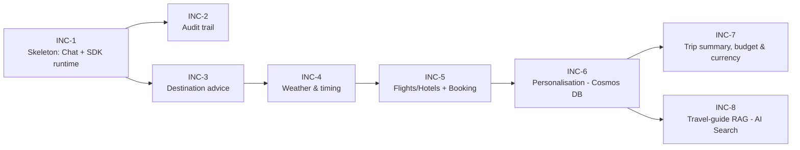

# Increment Delivery Plan — Waypoint

> Phase 1c artifact. Breaks the 7 approved FRDs into ordered, independently-shippable
> increments. **Walking skeleton first**, then by dependency chain. Every increment runs
> the full Phase 2 pipeline: **Tests → Contracts → Implementation → Verify & Ship**, and
> ends with `main` green + deployed to Azure.
>
> Traceability: PRD `specs/prd.md` · FRDs `specs/frd-*.md` · UI `specs/ui/`.

## Ordering principle

The critical path is **FRD-001 → FRD-003 → FRD-005 → FRD-007**. The audit trail
(FRD-002) is sequenced immediately after the skeleton because it is the demo's hero
feature and rides the same event stream. Weather (FRD-004) and personalisation (FRD-006)
slot in before the trip summary, which depends on all three of weather, search, and
personalisation.

## Increments

### INC-1 — Walking skeleton: Chat + Copilot SDK runtime
- **FRD:** FRD-001 · **Priority:** P0 · **Depends on:** — · **Complexity:** M
- **Scope:** End-to-end vertical slice — Next.js chat UI (welcome + conversation shell,
  header with New chat + logo-home), Express backend hosting a **GitHub Copilot SDK**
  agent with the holiday-planning system prompt, SSE-over-`fetch` streaming, per-session
  in-memory state, structured audit events emitted (no consumers yet), schema validation
  + secret redaction. **No skills/MCP tools yet** — the agent replies conversationally.
- **Screens/flows:** S1 Welcome, S2 Conversation (text only); Flow 1.
- **New tech introduced:** `@github/copilot-sdk`, Express SSE, Aspire wiring, Azure deploy.
- **Exit:** `POST /api/chat` streams a reply; deployed and reachable; New chat resets session.

### INC-2 — Audit trail side panel
- **FRD:** FRD-002 · **Priority:** P0 · **Depends on:** INC-1 · **Complexity:** M
- **Scope:** Toggleable slide-in panel (bottom sheet on mobile) consuming the INC-1 event
  stream; per-turn grouping; type/name/request/response/duration/status; pending→ok/error;
  server-side redaction; Clear (P0), Export (P3 optional); new-chat clears the trail.
- **Screens/flows:** S4 Audit open; Flow 6.
- **Exit:** Live events render for a plain conversation; redaction verified; toggle a11y.

### INC-3 — Destination advice
- **FRD:** FRD-003 · **Priority:** P0 · **Depends on:** INC-1 (audit visible via INC-2) · **Complexity:** S
- **Scope:** `destination-advisor` Copilot SDK **skill** — interests → 3–5 ranked
  destinations with rationale + tags; clarifying-question path; refinement; canonical names
  for downstream. Emits `skill` audit entries.
- **Screens/flows:** S2 destination card; Flow 2.
- **New tech introduced:** first custom SDK skill pattern.
- **Exit:** Interests produce a shortlist; vague input asks one question.

### INC-4 — Weather & best-time-to-travel
- **FRD:** FRD-004 · **Priority:** P0 · **Depends on:** INC-1, INC-3 · **Complexity:** M
- **Scope:** `weather-window` skill + **Open-Meteo MCP** (geocoding + ERA5 1991–2020
  climate). Month weather + best/avoid months, plain-English, source-cited; retry/degrade.
- **Screens/flows:** S2 weather card, S5 weather-down path; Flow 3, Flow 7 (weather).
- **New tech introduced:** first MCP server wiring (Open-Meteo).
- **Exit:** Grounded weather answer visible in chat + audit; MCP failure degrades gracefully.

### INC-5 — Flight & hotel search + simulated booking
- **FRD:** FRD-005 · **Priority:** P0/P1 · **Depends on:** INC-1, INC-3 · **Complexity:** L
- **Scope:** **RouteStack.ai MCP** (sandbox) flight + hotel search; ≤3 each; supplier
  currency preserved and normalised to **GBP** (Currency MCP path introduced here);
  `booking-simulator` mock confirmation (no payment); no-availability / quota degrade paths.
- **Screens/flows:** S2 flight/hotel cards, S3 booking, S5 no-availability/quota; Flow 4, Flow 5 (booking), Flow 7.
- **New tech introduced:** RouteStack MCP, Currency MCP (for GBP normalisation).
- **Exit:** Live options in GBP; selection yields a clearly-simulated confirmation.

### INC-6 — Personalisation via Cosmos DB (real MCP)
- **FRD:** FRD-006 · **Priority:** P1 · **Depends on:** INC-1, INC-3, INC-5 · **Complexity:** M
- **Scope:** Traveller profile — loyalty programme + **membership number** + tier + **reward
  points**; preferences (seat aisle/window/middle + dietary); and **past destinations**
  (city + country only) — stored in **Azure Cosmos DB (serverless)** and retrieved through a
  real MCP call: the self-hosted **`waypoint-data` MCP** tool `cosmos.getTravellerProfile`
  (ADR-007, ADR-009). Enriches suggestions/origin/seat+meal pre-select; header/summary
  reward points; booking echoes seat + meal + a **simulated** points accrual on the
  membership; graceful degradation if the store is unavailable. A deterministic offline
  profile backs tests.
- **Screens/flows:** S2 personalisation note, S5 personalisation-off; Flow 2, Flow 7.
- **New tech introduced:** Azure Cosmos DB (serverless) + the self-hosted `waypoint-data`
  MCP server (Container App); direct-grounding MCP client.
- **Exit:** Suggestions reference real profile facts fetched from Cosmos via a visible MCP
  call; Cosmos-down still functions.

### INC-7 — Trip summary, budget & currency
- **FRD:** FRD-007 · **Priority:** P1 · **Depends on:** INC-4, INC-5, INC-6 · **Complexity:** M
- **Scope:** `trip-summariser` + `budget-estimator` skills; itinerary card; budget maths
  `(flight × party) + (nightly × nights × rooms)`; taxes/fees labelling; **GBP default,
  EUR on request** via Currency MCP (rate + timestamp in audit); applied preferences +
  points; partial-selection + currency-fallback paths.
- **Screens/flows:** S3 summary/budget/currency, S5 currency-fallback; Flow 5, Flow 7.
- **Exit:** Correct totals; EUR toggle shows rate; personalisation reflected.

### INC-8 — Travel-guide knowledge base + data-driven destination advice
- **FRD:** FRD-003 (reworked) · **Priority:** P1 · **Depends on:** INC-6 · **Complexity:** L
- **Scope:** Vectorise the supplied travel-guide PDF (`src/assets/eBook - Where To
  Go-When…pdf`) into an **Azure AI Search (Free tier)** index via a Foundry **embedding
  deployment** (ADR-008). Add the `travel-guide.searchByMonth` tool to the `waypoint-data`
  MCP (ADR-009). The destination turn calls `cosmos.getTravellerProfile` +
  `travel-guide.searchByMonth` (**Shape A** — two real MCP calls) and the agent reasons
  over both to produce a **month-aware, preference-aware, guide-grounded** shortlist that
  avoids recently-visited past destinations. **Replaces the hardcoded `destination-advisor`
  pool** with data-driven results (same `destination-list` UI contract).
- **Screens/flows:** S2 destination card (now month-aware + guide-cited); Flow 2.
- **New tech introduced:** Azure AI Search (Free tier) vector index + Foundry embedding
  deployment; RAG over the guide.
- **Exit:** Asking for ideas for a given month returns guide-grounded, personalised
  suggestions; both MCP calls visible in the audit; FRD-003 scenarios/tests updated +
  re-approved.

## Summary

| Inc | FRD | Priority | Depends on | Complexity | New tech |
|-----|-----|----------|-----------|-----------|----------|
| INC-1 | FRD-001 | P0 | — | M | Copilot SDK, SSE, Aspire, azd |
| INC-2 | FRD-002 | P0 | INC-1 | M | — |
| INC-3 | FRD-003 | P0 | INC-1 | S | SDK skill |
| INC-4 | FRD-004 | P0 | INC-1, INC-3 | M | Open-Meteo MCP |
| INC-5 | FRD-005 | P0/P1 | INC-1, INC-3 | L | RouteStack MCP, Currency MCP |
| INC-6 | FRD-006 | P1 | INC-1, INC-3, INC-5 | M | Azure Cosmos DB + self-hosted waypoint-data MCP |
| INC-7 | FRD-007 | P1 | INC-4, INC-5, INC-6 | M | (Currency MCP reuse) |
| INC-8 | FRD-003 (reworked) | P1 | INC-6 | L | Azure AI Search (Free) + Foundry embeddings; travel-guide RAG |
**Demo-ready checkpoints:** after **INC-2** the "how the agent thinks" story is
demonstrable; after **INC-5** a full plan-and-book flow works; after **INC-7** the
complete experience (personalised, priced, EUR-convertible) is live.

## Notes
- Each increment is independently deployable and leaves `main` green + deployed.
- Human gates per increment: Gherkin approval, test-code approval, PR review, deploy verification.
- No increment introduces auth, real payments, or persistence (out of scope per PRD).
