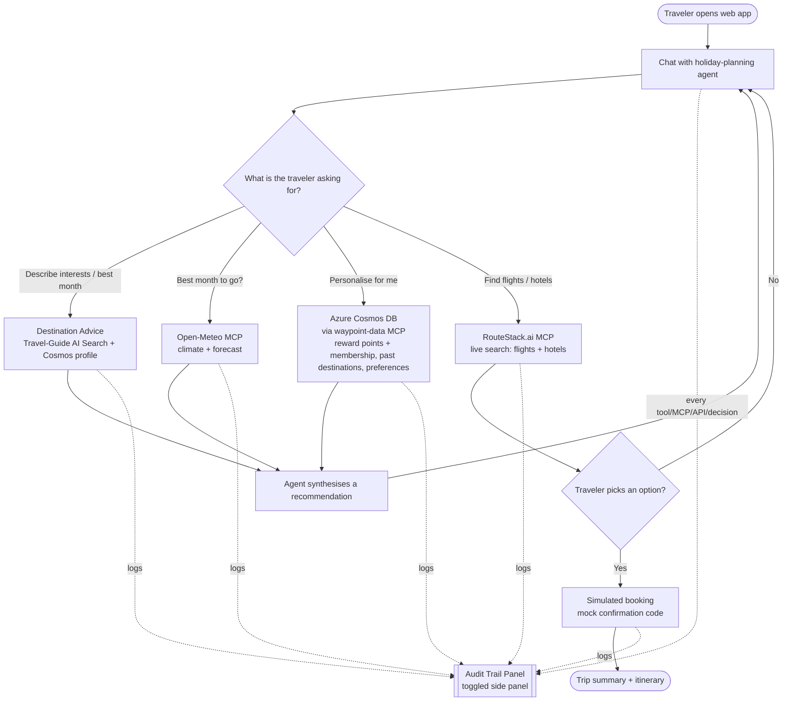
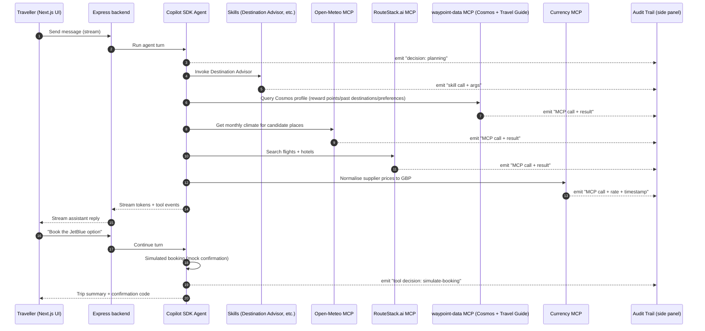

# Product Requirements Document

> **Provenance:** This is a **greenfield** PRD authored from a stakeholder vision
> brief (see Appendix A), not reverse-engineered from existing code. There is no
> source code yet. Statements about product intent come from the vision brief;
> statements about third-party capabilities come from web research conducted on
> 2026-08-12 (see Appendix A for sources). Anything not directly stated by the
> stakeholder is prefixed **Inferred:** with reasoning.

---

## Product Flow Diagram

---

## Product Vision

Waypoint is a deliberately small, crystal-clear reference web application that
demonstrates how quickly a capable AI agent can be built on the **GitHub Copilot
SDK**. Presented as an **interactive holiday-planning and booking assistant**, a
traveller chats naturally about the kinds of trips and activities they enjoy, and
the agent recommends destinations, tells them the best months to travel using real
climate data, personalises suggestions from synthetic profile data, and searches
live flights and hotels — booking is simulated end-to-end. Its second, equally
important purpose is **pedagogical transparency**: a toggled audit-trail side panel
exposes observable model-request lifecycle events, app-generated decision summaries,
tool calls, MCP requests, and API round-trips in real time, so a presenter can open
the codebase during a live demo and show an
organisation exactly how little code the Copilot SDK requires and exactly what the
agent is doing under the hood.

**Design north star:** the code must be *obvious*. Small surface area, strong and
concise comments, minimal abstractions — optimised for reading aloud in a room, not
for scale.

---

## User Personas

### Traveller (primary demo user)

- **Role**: An end user planning a holiday through conversation.
- **Needs**: Natural-language travel advice, weather/season guidance, personalised
  recommendations, live flight/hotel options, and a simple way to "book".
- **Goals**: Decide *where* to go, *when* to go, and *how* to get there and stay —
  without leaving the chat.
- **Source**: Explicit in vision brief. Single demo user, **no authentication**.

### Demo Presenter (secondary — the person running the demo)

- **Role**: The engineer/advocate showcasing the app to an organisation.
- **Needs**: A visible, trustworthy audit trail of the agent's reasoning and calls;
  readable, well-commented source code that maps 1:1 to what the audience sees.
- **Goals**: Prove that the Copilot SDK makes agent-building fast and that agent
  behaviour is inspectable and safe.
- **Source**: **Inferred:** from the stakeholder's stated intent to "go into the
  codebase and showcase how easy the GitHub Copilot SDK is" and to demonstrate the
  audit trail live. This persona drives the audit-panel and code-clarity requirements.

### Holiday-Planning Agent (system persona)

- **Role**: The Copilot SDK agent runtime that plans, decides, and invokes tools.
- **Needs**: Access to skills (custom domain logic), MCP servers (weather, travel,
  Cosmos profile + travel-guide search), SDK lifecycle events, a permission handler, and application
  instrumentation to emit observable audit events.
- **Goals**: Fulfil the traveller's request by orchestrating skills and MCP tools.
- **Source**: **Inferred:** the SDK exposes a programmatic agent runtime with custom
  agents/skills/tools/MCP and a per-tool permission handler (Appendix A).

---

## Feature List

| ID | Feature | Description | Priority | Dependencies |
|----|---------|-------------|----------|--------------|
| F-001 | Conversational chat UI | Single-page chat interface (Next.js) where the traveller talks to the agent; streaming responses; a **New chat** control to reset the session, and a logo that returns to home. | P0 | — |
| F-002 | Copilot SDK agent runtime | Backend (Express) hosts a GitHub Copilot SDK agent that plans and invokes skills/tools/MCP. Streams tokens and tool events to the UI. | P0 | F-001 |
| F-003 | Audit-trail side panel | Toggleable panel showing a live, chronological log of observable orchestration events: model request lifecycle, app-generated decision summaries, permission decisions, skill invocations, MCP calls, retries, and outbound API calls with inputs/outputs, timing, and status. Hidden model reasoning/chain-of-thought is never requested or displayed. | P0 | F-002 |
| F-004 | Destination advice (guide-grounded, personalised) | Traveller describes interests (and optionally a target month); the agent recommends destinations **grounded in a travel-guide knowledge base (Azure AI Search)** and **personalised from the Cosmos profile** (preferences + past destinations), month-aware. Replaces the earlier hardcoded pool (INC-8). | P0 | F-002, F-008 |
| F-005 | Weather & best-time-to-travel (Open-Meteo MCP) | Agent retrieves monthly climate/forecast for a place via the Open-Meteo MCP and advises on ideal travel months. | P0 | F-002 |
| F-006 | Live flight & hotel search (RouteStack.ai MCP) | For a chosen destination, the agent searches live flights and hotels via RouteStack's MCP-native travel API (sandbox), preserves supplier currency, and normalises displayed prices to GBP through the Currency MCP. | P0 | F-002, F-004 |
| F-007 | Simulated booking | Traveller selects an option; the agent produces a mock confirmation (no payment, no real reservation). | P1 | F-006 |
| F-008 | Personalisation via Cosmos DB (waypoint-data MCP) | Agent enriches recommendations using a synthetic traveller profile stored in **Azure Cosmos DB** (serverless) and retrieved via the self-hosted **`waypoint-data` MCP** (`cosmos.getTravellerProfile`): loyalty profile (reward-programme **membership number**, tier, **reward points** balance), **past destinations** (city + country), and travel preferences (**seat** — aisle/window/middle — and **dietary** requirement). At simulated booking the confirmation echoes the assigned seat + meal and a **simulated reward-points accrual** (display only). This is a **B2C** traveller product — no corporate/travel-policy data. | P1 | F-002 |
| F-009 | Trip summary / itinerary | The agent assembles a readable summary of the chosen destination, dates, weather note, flight, and hotel. | P1 | F-005, F-006 |
| F-010 | Well-commented, demo-ready codebase | Source is structured and annotated for live walkthrough; concise comments explain intent, not mechanics. | P0 | — |
| F-011 | Budget estimate + currency conversion (Budget Estimator skill + Currency MCP) | A small skill totals flight + hotel. Prices display in **GBP by default** with an option to convert to **EUR** (demo audience is Spain-based) via a Currency MCP. | P1 | F-006 |
| F-012 | Audit export / clear | **Inferred:** presenter can clear the audit log between demo runs and optionally copy/export the current trail. | P3 | F-003 |

---

## Non-Functional Requirements

### Performance
- The first visible stream event (for example, model request started or tool progress)
  appears within 2s on the demo network; content tokens stream as soon as available.
- RouteStack advertises < 100 ms search latency and Open-Meteo returns simple JSON;
  MCP calls should feel near-instant in the demo. **Inferred:** no load-testing or
  CDN needed for a single-presenter demo.

### Security
- **No hardcoded secrets.** `ROUTESTACK_API_KEY`/`ROUTESTACK_SECRET` come from environment
  variables only; the model (Microsoft Foundry) and data stores (Cosmos DB, Azure AI
  Search) use **managed identity** (keyless). *(The original `COPILOT_GITHUB_TOKEN` path is
  retained commented — ADR-005.)*
- Single demo user, no auth surface; the app must not be exposed publicly with live
  booking. Booking is simulated, so no PCI/payment scope.
- The Copilot SDK per-tool **permission handler** governs tool execution. SDK events
  plus application instrumentation produce observable audit events; hidden model
  reasoning/chain-of-thought is not captured or displayed.
- Outbound MCP allowlist: only the declared MCP servers are enabled (`routestack, open-meteo, currency, cosmos, travel-guide`).
- Traveller prompts and all MCP/API responses are untrusted input. The backend
  validates tool arguments and external responses against schemas, limits payload
  sizes, redacts secrets before streaming, and treats returned prose as data rather
  than executable instructions.

### Reliability
- Every external call (MCP/API) has explicit error handling; failures surface in the
  chat *and* the audit panel rather than crashing the agent loop.
- The demo tolerates RouteStack sandbox limits and Open-Meteo's free-tier caps;
  degraded responses are shown, not fatal errors.

### Scalability
- **Out of demo scope by design.** Single-process Express backend, one concurrent
  user assumed. **Inferred:** no autoscaling, queues, or multi-tenancy.

### Observability
- The audit trail *is* the primary observability surface: structured, per-turn events
  (decision → skill/tool selection → MCP/API request → response → timing → status).
- Backend uses structured logging (not `console.log`) mirroring audit events.

---

## Out of Scope

- **Real payments / real reservations.** Booking is simulated; no merchant, no Stripe,
  no ticketing. (RouteStack *can* handle real checkout — intentionally not used.)
- **Authentication, accounts, multi-user, or persistence of user profiles.** Single
  demo user; profile data is synthetic and read-only from Cosmos DB.
- **Production hardening**: rate limiting, autoscaling, HA, CDN, secrets vaulting
  beyond env vars.
- **Native mobile apps** and offline support.
- **Full travel coverage** (visas, insurance, activities/tours booking, seat maps,
  loyalty accrual). **Car rental is out of scope** (RouteStack supports it; the demo
  uses flights + hotels only).
- **Model fine-tuning or custom model hosting** — uses models available through the
  Copilot SDK.
- **Analytics/BI dashboards** beyond the in-app audit trail.

---

## Implementation Diagram

**Why this diagram helps:** it makes the audit panel's role explicit — SDK events and
application instrumentation emit observable orchestration events for the presenter to
narrate. The panel never requests or displays hidden model reasoning/chain-of-thought.

---

## Appendix A: Sources & Evidence

Greenfield equivalent of the brownfield extraction-evidence appendix — every section
above traces to one of these sources.

| PRD Section | Source |
|-------------|--------|
| Product Vision, Personas, Scope | Stakeholder vision brief (2026-08-12 conversation) |
| Copilot SDK capabilities (agent runtime, skills, tools, MCP, permission handler, BYOK, streaming) | `github/copilot-sdk` README — `npm install @github/copilot-sdk`; "same engine behind Copilot CLI", custom agents/skills/tools/MCP, per-tool permission handler |
| Flight/hotel search + simulated booking | RouteStack.ai — MCP-native travel API, 3M+ hotels / 950+ airlines, free sandbox with real cached data, `@routestack/sdk`, hosted checkout (unused) |
| Weather / best-time-to-travel | Open-Meteo — free no-key JSON weather API; forecast, historical (ERA5 from 1940), climate, and geocoding endpoints; community Open-Meteo MCP wrapper |
| Personalisation data | Azure Cosmos DB (serverless) traveller profile + Azure AI Search travel-guide index, consumed over the self-hosted `waypoint-data` MCP (synthetic data defined in Appendix B; ADR-007/008/009) |

---

## Appendix B: Recommended Skills, MCP Servers & Data Stores

This appendix answers the stakeholder's explicit requests. **Inferred:** these are
*recommendations* for what to build/wire; none are pre-existing published assets
except the MCP servers/APIs noted.

### B.1 Skills (custom, authored on the Copilot SDK skill mechanism)

| Skill | Purpose | Priority |
|-------|---------|----------|
| `destination-advisor` | Turn free-text interests ("warm, walkable, great food, not too touristy") into ranked destination suggestions with rationale. | P0 |
| `weather-window` | Interpret Open-Meteo climate data into a plain-English "best months to visit / avoid" recommendation. | P0 |
| `trip-summariser` | Assemble the final itinerary card (destination + dates + weather note + flight + hotel). | P1 |
| `budget-estimator` | Total flight + hotel; drive GBP→EUR conversion via the Currency MCP. | P1 |
| `booking-simulator` | Produce a deterministic mock confirmation (code, PNR-like ref) without transacting. | P1 |

> Keep each skill tiny and heavily commented — they double as the "look how simple a
> skill is" teaching moment in the demo.

### B.2 MCP Servers

| MCP Server | Role | Notes |
|-----------|------|-------|
| **RouteStack.ai** (core) | Live flights + hotels; simulated booking | MCP-native; free unlimited **sandbox** with real cached data; swap key for prod. Use sandbox for the demo. Car rental supported but unused. |
| **Open-Meteo MCP** (core) | Weather forecast + monthly climate averages + geocoding | Wraps the free, no-API-key Open-Meteo endpoints (Forecast, Historical/ERA5, Climate, Geocoding). |
| **waypoint-data** (self-hosted, core) | `cosmos.getTravellerProfile` (Cosmos DB profile) + `travel-guide.searchByMonth` (AI Search travel-guide index) | Real MCP calls the agent reasons over; keyless via managed identity (ADR-007/008/009). |
| **Currency-exchange MCP** (core) | Convert displayed prices; **GBP default, EUR on request** | Powers F-011. Default all prices to GBP; convert to EUR for the Spain-based demo audience. |

> Already present in `.mcp.json` for *development* (not app runtime): `github`,
> `playwright`, `azure`, `deepwiki`, `context7`, `microsoft.docs.mcp`, `aspire`.
> The four core servers above are what the **agent** consumes at runtime.

### B.3 Synthetic Data — Cosmos Profile + Travel-Guide Knowledge Base

Synthetic data the `waypoint-data` MCP serves so the demo can show "the agent is
querying my profile and a travel guide". All fictional; one demo traveller ("John Doe").

| Dataset | Fields (illustrative) | What it enables in the demo |
|---------|-----------------------|-----------------------------|
| **Traveller loyalty profile** (Cosmos) | tier (Gold), **reward points balance (7,463)**, **membership number**, preferred airlines, preferred cabin | "Because you're Gold Tier with 7,463 points, I prioritised your preferred airlines…" |
| **Past destinations** (Cosmos) | city + country (e.g. Lisbon, Portugal) | "You've already been to Lisbon — here's somewhere new that fits." |
| **Travel preferences** (Cosmos) | **seat preference (aisle)**, **dietary (vegetarian)** | Pre-selects aisle seat + vegetarian meal; echoed at booking (seat 23C + points). |
| **Travel-guide knowledge base** (AI Search) | vectorised PDF — best places to visit per month | Grounds **month-aware** destination advice (INC-8); the agent cites the guide. |

> **Approved MVP:** *loyalty profile* (incl. reward points + membership), *past destinations*
> (city + country), and *travel preferences* (aisle seat, vegetarian meal), stored in
> **Cosmos DB**; plus the **travel-guide** knowledge base in **Azure AI Search** (INC-8).
> This is a B2C product — there is no corporate travel-policy dataset.

---

## Human Gate

**Approved.** Initially approved on 2026-08-12 and revised with stakeholder approval
after the final specification review. The revision excludes the proposed accessibility
requirements at the stakeholder's direction.

- **Features identified:** 12 (F-001…F-012); 6 are P0.
- **Personas:** 3 (Traveller = explicit; Demo Presenter & Agent = inferred, high confidence).
- **Heavy-inference areas (lower confidence):** profile / knowledge-base specifics (B.3),
  Budget Estimator (F-011), audit export (F-012), and exact Copilot SDK skill vs. tool
  boundaries — all flagged **Inferred:**.
- **Simulated/stubbed by design:** booking (F-007) is intentionally mock; car rental
  is out of scope; audit export (F-012) is stretch. Currency conversion (GBP default,
  EUR option) is now a core demo feature.
- **Diagrams included:** Product Flow (flowchart) + Implementation (sequence) — both
  materially aid understanding, so neither was omitted.

