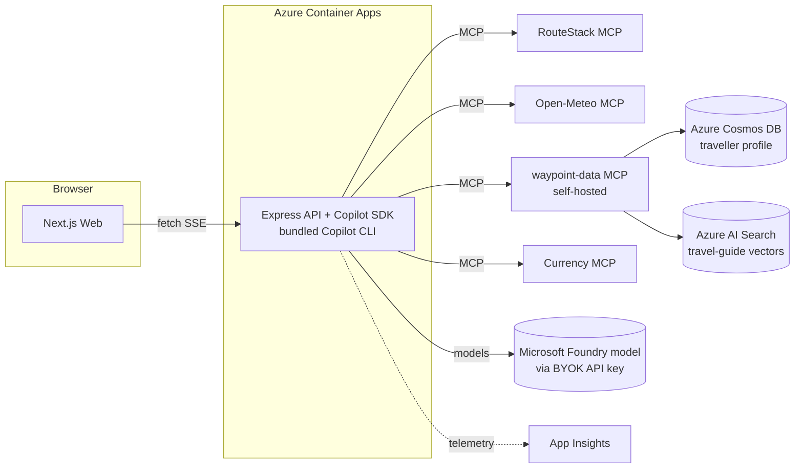

# Tech Stack — Waypoint

> Phase 1d artifact. Resolves **how** Waypoint is built. Inputs: approved FRDs,
> UI/UX artifacts, [increment plan](increment-plan.md). Research grounded via the
> `github/copilot-sdk` docs (2026-08-12) and prior MCP-server research. Binding for all
> increments. Significant choices are captured as ADRs in `specs/adrs/`.
>
> **Design north star:** the code is read aloud in a demo — prefer the smallest number of
> clear, well-commented moving parts over cleverness or heavy abstractions.

## Overview

Waypoint is a **TypeScript monorepo**: a **Next.js** web app talks to a **Node/Express**
API that embeds the **GitHub Copilot SDK** agent runtime. The agent orchestrates a small
set of custom **skills** and MCP servers (RouteStack, Open-Meteo, Currency, and a
self-hosted **`waypoint-data`** MCP fronting **Azure Cosmos DB** + **Azure AI Search**).
Local orchestration is **.NET Aspire**; deployment is **Azure Container Apps** via
**azd + Bicep**. The only persistent data is a synthetic traveller profile in Cosmos and a
travel-guide vector index in AI Search; sessions stay in-memory; booking is simulated.

## Resolved technologies

### AI / Agent runtime — GitHub Copilot SDK
- **Purpose:** The core of the app — the programmatic agent that plans, streams, and calls skills/MCP tools.
- **Choice:** `@github/copilot-sdk` (Node/TypeScript) — over LangGraph.js or a direct model SDK. See **ADR-001**.
- **Version:** `@github/copilot-sdk` ^1 (pin latest at scaffold).
- **Rationale:** It *is* the demo subject; production-tested agent runtime; native custom skills, tools, MCP, and a per-tool permission handler that powers the audit trail.
- **Wiring:** The Node SDK **bundles the Copilot CLI** and runs it headless (subprocess/TCP). Instantiate one agent per request with the holiday-planning system prompt; register skills + MCP servers; attach a permission/telemetry hook that emits audit events. Stream tokens/tool events to the client.
- **Anti-patterns:** Don't build a bespoke planning loop; don't expose hidden model reasoning; don't disable the permission handler.
- **Docs:** github.com/github/copilot-sdk (`docs/features`, `docs/setup/backend-services.md`).

### Model + auth — BYOK → Microsoft Foundry (API key)
- **Purpose:** Which model powers the agent and how the deployed container authenticates.
- **Choice:** **BYOK → Microsoft Foundry** model deployment, **managed-identity** auth (Entra; the subscription disables API keys). `FOUNDRY_MODEL_URL` + `FOUNDRY_MODEL` + `FOUNDRY_USE_MANAGED_IDENTITY`. Supersedes the `COPILOT_GITHUB_TOKEN` choice. See **ADR-005** (supersedes the auth part of **ADR-002**).
- **Rationale:** Azure-native model governance and pay-as-you-go billing; keyless. The Copilot SDK is kept (only its `provider` block changes). The original GitHub-token path is retained commented-out for the demo.
- **Wiring:** Copilot SDK `createSession({ model, provider: { type: 'openai', baseUrl: '<endpoint>/openai/v1/', bearerTokenProvider, wireApi } })`; `model` = the Foundry **deployment name**. The Foundry resource + deployment are provisioned as IaC (`infra/modules/foundry.bicep`) and the Container App's managed identity is granted **Cognitive Services OpenAI User** — no key/secret.
- **Note:** BYOK's built-in fields are key-based; managed identity uses the SDK's `bearerTokenProvider` callback (`DefaultAzureCredential`).
- **Anti-patterns:** No key in code/client; never log it (redact server-side).

### Frontend framework — Next.js + React
- **Purpose:** The single-page chat UI (welcome, conversation, trip summary, audit panel).
- **Choice:** **Next.js 15 (App Router)** + **React 19**, TypeScript.
- **Wiring:** Client component streams `POST /api/chat` via `fetch()` + `ReadableStream` (per FRD-001). App shell = header (logo→home, New chat, audit toggle) + chat column + audit panel.
- **Deployment:** Its own Container App (`web`), Node runtime.

### Frontend styling & components — CSS Modules + design tokens
- **Purpose:** Implement the approved design system with minimal build magic.
- **Choice:** **CSS Modules + CSS custom properties** mirroring `specs/ui/design-system.md` (over Tailwind) — see **ADR-004**. Icons: inline **Lucide-style SVG** (no emoji). Motion tokens (`--ease-out`, `--ease-drawer`, press feedback, `@starting-style`, `prefers-reduced-motion`) copied from the design system.
- **State/data:** React hooks + a small context for session + audit event stream; native `fetch`/SSE (no SWR/TanStack needed).

### Backend framework — Node / Express
- **Purpose:** Host the Copilot SDK agent and the `/api/chat` SSE endpoint.
- **Choice:** **Express 5** on **Node 22 LTS**, TypeScript.
- **Wiring:** `POST /api/chat` returns `text/event-stream`; per-session in-memory store keyed by `sessionId`; structured events (`token|decision|tool_call|tool_result|done|error`).
- **Validation:** **Zod** for chat requests, tool arguments, and MCP/API responses (FR-001-8/09). **Secret redaction** middleware before logging/streaming (FR-001-10).
- **Rate limiting:** Not required (single demo user); `express-rate-limit` noted as optional hardening.

### MCP servers (agent runtime)
| Server | Package/endpoint | Purpose | Secret | Increment |
|--------|------------------|---------|--------|-----------|
| **RouteStack.ai** | `@routestack/sdk` / MCP (sandbox) | Live flights + hotels; simulated booking | `ROUTESTACK_API_KEY` | INC-5 |
| **Open-Meteo** | direct REST client (`geocoding-api` + `archive-api`, keyless) | Geocoding + ERA5 1991–2020 climate | none (keyless) | INC-4 |
| **waypoint-data (self-hosted)** | own Container App, Streamable HTTP; managed identity | `cosmos.getTravellerProfile` (Cosmos DB, INC-6) + `travel-guide.searchByMonth` (AI Search, INC-8) | none (managed identity) | INC-6 / INC-8 |
| **Currency** | currency-exchange MCP | GBP→EUR conversion + rate/timestamp | `CURRENCY_API_KEY` (if required) | INC-5, INC-7 |
- **Wiring:** RouteStack/Open-Meteo/Currency are reached by **direct grounding** (the API calls them and emits `mcp` audit entries — ADR-006). The **`waypoint-data`** MCP is a real MCP server the API calls as a client over the wire (ADR-009); `cosmos`/`travel-guide` are added to the audit classifier + runtime allowlist. Secrets from Container Apps secrets/env; Cosmos + AI Search use **managed identity** (keyless). All calls validated + redacted.

### Custom Copilot SDK skills (in-app, 5)
`destination-advisor` (INC-3), `weather-window` (INC-4), `booking-simulator` (INC-5),
`trip-summariser` + `budget-estimator` (INC-7). Small, heavily commented — each doubles as
a "look how simple a skill is" teaching moment. Live in `src/api/src/skills/`.

### Real-time — Server-Sent Events
- **Choice:** SSE over a `fetch` POST stream (per FRD-001). No SignalR/WebSockets — single user, one stream per turn.

### Observability — Application Insights + pino + OpenTelemetry
- **Purpose:** Backend telemetry mirroring the in-app audit trail (the primary UX observability surface).
- **Choice:** **Azure Application Insights** (via Aspire/OpenTelemetry) + **pino** structured logging (no `console.log`). Connection string from managed identity/secret.

### Local orchestration — .NET Aspire
- **Purpose:** Run API + Web together locally, wire env/service discovery, emit OTEL.
- **Choice:** **Aspire AppHost** (C#) referencing the two Node services; `aspire start` runs everything. Tests (Cucumber/Playwright) run against the Aspire environment.

### Infrastructure & deployment — Azure Container Apps via azd + Bicep
- **Choice:** **Azure Container Apps** for `api` and `web`; **azd** provisions/deploys; **Bicep** in `infra/`. See **ADR-003**. Supporting: **Azure Container Registry**, **Log Analytics**, **Application Insights**, **user-assigned Managed Identity** (ACR pull + App Insights + optional Foundry BYOK). Secrets as **Container App secrets** (Key Vault optional hardening).

### Shared types & testing
- **Shared types:** TypeScript in `src/shared/types/` (ChatMessage, AgentEvent, AuditEntry, FlightOption, HotelOption, Money/ConvertedMoney, TripSummary, LoyaltyProfile, PastTrip, TravelPreferences, WeatherWindow, BookingConfirmation).
- **Testing:** **Vitest** (unit, API slice), **Cucumber.js** (BDD/Gherkin), **Playwright** (e2e) — all against the Aspire environment. Skip-detection enforced per AGENTS.md §9.

## Categories evaluated (explicit "not needed")

| # | Category | Decision |
|---|----------|----------|
| 1 | Data storage | **Azure Cosmos DB (serverless)** — synthetic traveller profile (ADR-007); **Azure AI Search (Free)** — travel-guide vector index (ADR-008). Chat sessions stay in-memory. |
| 2 | Caching | **None** — optional in-memory memoisation of a currency rate per turn. |
| 3 | AI/ML | **GitHub Copilot SDK** (runtime + Foundry model) + a Foundry **embedding deployment** (`text-embedding-3-small`) for the travel-guide index (INC-8) + custom SSE streaming. |
| 4 | Voice/Speech | Not needed. |
| 5 | Auth | **None** for users — single demo user, no login. Azure resources use **managed identity** (Cosmos, AI Search, Foundry). |
| 6 | Real-time | **SSE** (fetch stream). |
| 7 | Search | **Azure AI Search (Free tier)** vector/hybrid search over the travel-guide PDF (INC-8). Travel search is RouteStack MCP (not app search). |
| 8 | File storage | Not needed. |
| 9 | Messaging/events | **None** — in-process. |
| 10 | Observability | **App Insights + pino + OpenTelemetry**; audit trail = UX observability. |
| 11 | Infra/deploy | **Azure Container Apps + azd/Bicep + Aspire**. |
| 12 | Frontend libs | Next.js/React, CSS Modules + tokens, native fetch/SSE, Lucide SVG. |
| 13 | Backend libs | Express, Zod, pino; optional express-rate-limit. |

## Infrastructure Resources

| Resource | Type | SKU / tier | Purpose | Auth | Increment |
|----------|------|-----------|---------|------|-----------|
| Container Apps Environment | `Microsoft.App/managedEnvironments` | Consumption (serverless) | Host for api + web | — | INC-1 |
| API Container App | `Microsoft.App/containerApps` | Consumption, **min 0 / max 1** (scale-to-zero), 0.5 vCPU/1Gi | Express + Copilot SDK (bundled CLI) | Managed identity + secrets | INC-1 |
| Web Container App | `Microsoft.App/containerApps` | Consumption, **min 0 / max 1** (scale-to-zero), 0.25 vCPU/0.5Gi | Next.js | Managed identity | INC-1 |
| Container Registry | `Microsoft.ContainerRegistry/registries` | **Basic** (cheapest) | Image storage | Managed identity (AcrPull) | INC-1 |
| Log Analytics Workspace | `Microsoft.OperationalInsights/workspaces` | PerGB2018, **30-day retention + daily cap** | Logs | — | INC-1 |
| Application Insights | `Microsoft.Insights/components` | Workspace-based, **sampling on** | Telemetry | Managed identity | INC-1 |
| User-assigned Managed Identity | `Microsoft.ManagedIdentity/userAssignedIdentities` | — (**free**) | ACR pull, App Insights, Foundry/Cosmos/Search data-plane | — | INC-1 |
| **Azure Cosmos DB** | `Microsoft.DocumentDB/databaseAccounts` | **Serverless** | Synthetic traveller profile (ADR-007) | Managed identity (Cosmos Data Reader) | INC-6 |
| **waypoint-data MCP** | `Microsoft.App/containerApps` | Consumption, scale-to-zero, **internal** | Cosmos + AI Search retrieval tools (ADR-009) | Managed identity | INC-6 |
| **Azure AI Search** | `Microsoft.Search/searchServices` | **Free** | Travel-guide vector index (ADR-008) | Managed identity (Search Index Data Reader) | INC-8 |
| Foundry embedding deployment | `Microsoft.CognitiveServices/accounts/deployments` | `text-embedding-3-small` | Embeds the guide PDF (ADR-008) | Managed identity | INC-8 |
| *(optional, skipped by default)* Key Vault | `Microsoft.KeyVault/vaults` | Standard | Secret hardening | Managed identity | INC-1+ |

**External (not azd-provisioned) — prerequisites:**
- **RouteStack.ai** sandbox account/key (INC-5); **Open-Meteo** (keyless, INC-4); **Currency** MCP (keyless Frankfurter, INC-5/7).

> Cosmos DB (INC-6) and Azure AI Search (INC-8) are **azd-provisioned** (see the table above), reached **keyless via managed identity** through the self-hosted `waypoint-data` MCP — there is **no external Fabric dependency**.

**Container App secrets / env (by increment):**
- INC-1: Foundry BYOK vars (`FOUNDRY_MODEL_URL` / `FOUNDRY_MODEL` / `FOUNDRY_USE_MANAGED_IDENTITY`; ADR-005), `APPLICATIONINSIGHTS_CONNECTION_STRING`.
- INC-5: `ROUTESTACK_API_KEY`, `ROUTESTACK_SECRET`.
- INC-6: `WAYPOINT_DATA_MCP_URL` — **no secret** (Cosmos is keyless via managed identity).
- INC-8: none new — AI Search is keyless via managed identity.

## Cost optimisation (single-user demo)

Goal: keep idle cost near zero and pay only while demoing.

| Item | Cost-saving choice | Notes |
|------|--------------------|-------|
| Compute | **Container Apps Consumption, scale-to-zero** (min replicas 0) | ~£0 when idle; pay only during a demo. Trade-off: a ~few-second **cold start** on the first request (warm it just before presenting). |
| Registry | **Basic ACR** | Cheapest tier; ample for two small images. |
| Logs | **Log Analytics 30-day retention + daily cap**; **App Insights sampling** | Caps ingestion cost; demo volume is tiny. |
| Secrets | **Container App secrets** (skip Key Vault) | Key Vault is optional hardening; ACA secrets are free. |
| Identity | **User-assigned managed identity** | Free; avoids key sprawl. |
| Model | **Foundry BYOK, managed identity** (ADR-005) | Pay-as-you-go Azure model spend; keyless. Original `COPILOT_GITHUB_TOKEN` path kept commented for the demo. |
| RouteStack | **Free sandbox (Hiker tier)** | Real cached data, 400 free tokens — £0 for the demo. |
| Open-Meteo | **Free, keyless** | Non-commercial free tier. |
| Currency | **Keyless/free provider** | Frankfurter (ECB) — no key. |
| **Cosmos DB** | **Serverless** (or free tier) | Pay-per-request; ~£0 at demo scale. |
| **Azure AI Search** | **Free tier** | 50 MB / vector search; £0. Basic only if outgrown. |
| **waypoint-data MCP** | **Container App, scale-to-zero** | ~£0 idle; internal ingress only. |

**Teardown:** `azd down` removes all provisioned Azure resources between demos, **including Cosmos DB and AI Search**. No external capacity to pause.

## Per-increment technology map

| Inc | New tech introduced | Azure resources | New secrets |
|-----|--------------------|-----------------|-------------|
| INC-1 | Copilot SDK, Express SSE, Next.js, Aspire, azd/Bicep, App Insights, pino, Zod, Vitest/Cucumber/Playwright | All INC-1 resources above | `COPILOT_GITHUB_TOKEN` |
| INC-2 | — (consumes SDK event stream) | — | — |
| INC-3 | first custom SDK **skill** | — | — |
| INC-4 | **Open-Meteo grounding** (direct REST client; ADR-006 — pivoted from a self-hosted MCP to a REST client because the SDK preview could not surface MCP tools to a Foundry-BYOK session) | — (egress only) | — |
| INC-5 | **RouteStack MCP**, **Currency MCP**, `booking-simulator` | — | `ROUTESTACK_API_KEY`, `ROUTESTACK_SECRET` |
| INC-6 | **Azure Cosmos DB** (serverless) + self-hosted **`waypoint-data` MCP** | Cosmos DB, waypoint-data Container App | — (keyless; `WAYPOINT_DATA_MCP_URL`) |
| INC-7 | `trip-summariser`, `budget-estimator` (Currency reuse) | — | — |
| INC-8 | **Azure AI Search** (Free) + Foundry **`text-embedding-3-small`**; travel-guide RAG | AI Search, embedding deployment | — (keyless) |

## Notes / gaps
- `infra/main.bicep` does not exist yet — it is generated during **INC-1** deployment to match `specs/contracts/infra/resources.yaml`. The azure-deployment skill validates parity at ship time.
- Currency MCP: the Frankfurter provider is keyless — no `CURRENCY_API_KEY`.
- Cosmos DB (INC-6), Azure AI Search (INC-8) and the `waypoint-data` MCP are added to `infra/main.bicep` at their increments to match the infra contract; all use **managed identity** (ADR-007 / ADR-008 / ADR-009). Fabric has been **dropped** (ADR-007).
