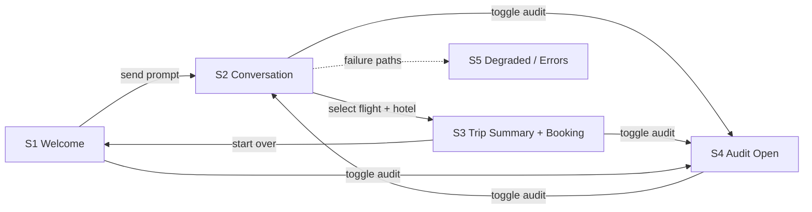

# Screen Map — Waypoint

> Phase 1b artifact. Source: approved [PRD](../prd.md) and FRD-001…FRD-007.
> Waypoint is a **single-page conversational app**, so "screens" are **states of one
> app shell** (header + chat column + slide-in audit panel), not separate routed pages.
> Each state is prototyped as a standalone HTML file for review and as a source of
> `data-testid` selectors for downstream phases.

## App Shell (persistent chrome)

| Region | Contents | FRD |
|--------|----------|-----|
| Header | Product mark "Waypoint" (links to home / prototype menu), demo-user chip ("John Doe · Gold Tier · 7,463 Pts"), **New chat** button, **Audit trail toggle** | FRD-001, FRD-002, FRD-006 |
| Chat column | Scrollable message list + composer (textarea + send) | FRD-001 |
| Audit panel | Right slide-in panel (bottom sheet on mobile): live event list, Clear, Export (P3), empty state | FRD-002 |

## Screens / States

### S1 — Welcome (empty state)
- **File:** [prototypes/welcome.html](prototypes/welcome.html)
- **Purpose:** First-run state before any message. Sets expectations and seeds intent.
- **Serves:** FRD-001 (chat entry), FRD-003/004/006 (suggested prompts)
- **Key elements:** greeting, 3–4 example prompt chips ("Somewhere warm in October", "Best time to visit Iceland", "Plan a trip like my last one"), composer.
- **Navigation:** Sending a prompt → **S2**. Audit toggle → opens panel (**S4**).

### S2 — Active conversation (rich cards)
- **File:** [prototypes/conversation.html](prototypes/conversation.html)
- **Purpose:** The core loop — user turns, streamed assistant replies, and rich in-chat cards.
- **Serves:** FRD-001, FRD-003, FRD-004, FRD-005, FRD-006, FRD-007
- **Card types rendered inline:**
  - **Destination suggestions** (ranked list w/ rationale + tags) — FRD-003
  - **Weather window** (best months / avoid months, source: Open-Meteo) — FRD-004
  - **Flight options** (≤3, airline/route/duration/stops/GBP, "best" badge) — FRD-005
  - **Hotel options** (≤3, name/rating/nightly GBP) — FRD-005
  - **Personalisation note** (loyalty + points, history, and seat/meal preference rationale) — FRD-006
- **States:** streaming (typing indicator), tool-in-progress inline chips, error notice.
- **Navigation:** Select flight+hotel → **S3**. Audit toggle → **S4**. "Show in euros" → currency toggles on cards/summary (FRD-007).

### S3 — Trip summary & simulated booking
- **File:** [prototypes/trip-summary.html](prototypes/trip-summary.html)
- **Purpose:** Assembled itinerary card + budget (GBP default, EUR toggle) + applied preferences & points + **simulated** booking confirmation.
- **Serves:** FRD-005 (simulated booking), FRD-007 (summary, budget, currency)
- **Key elements:** summary card (destination, dates, party, nights, rooms, weather note, flight, hotel), line-item budget with maths, GBP⇄EUR toggle, applied aisle-seat/meal preference + points balance, **"Demo simulation" confirmation** with reference code.
- **Navigation:** "Start over" → **S1**. Audit toggle → **S4**.

### S4 — Audit trail open
- **File:** [prototypes/audit-panel.html](prototypes/audit-panel.html)
- **Purpose:** The hero demo view — conversation on the left, live audit panel on the right.
- **Serves:** FRD-002 (+ shows events emitted by FRD-003/004/005/006/007)
- **Key elements:** panel header (title, Clear, Export), grouped entries by turn, per-entry type badge (decision/skill/mcp/api), name, request/response summary (truncated + expand), duration, status (pending/ok/error), redacted secrets, empty state.
- **Navigation:** Toggle → closes back to **S2**. Expand entry → inline detail.

### S5 — Degraded & error states
- **File:** [prototypes/error-states.html](prototypes/error-states.html)
- **Purpose:** Show graceful degradation for the demo's failure paths.
- **Serves:** FRD-004 (weather MCP down), FRD-005 (no availability / sandbox quota), FRD-006 (Fabric unavailable → personalisation off), FRD-007 (currency fallback to GBP)
- **Key elements:** non-fatal in-chat error notices, matching `error`-status audit entries, "personalisation unavailable" banner.

### Hub
- **File:** [prototypes/index.html](prototypes/index.html)
- **Purpose:** Entry point linking to every state for review.

## Navigation Flow

## Screen → FRD coverage

| Screen | FRD-001 | FRD-002 | FRD-003 | FRD-004 | FRD-005 | FRD-006 | FRD-007 |
|--------|:---:|:---:|:---:|:---:|:---:|:---:|:---:|
| S1 Welcome | ● | ○ | ○ | ○ | | ○ | |
| S2 Conversation | ● | ○ | ● | ● | ● | ● | ● |
| S3 Trip Summary | ● | ○ | | ○ | ● | ● | ● |
| S4 Audit Open | ○ | ● | ○ | ○ | ○ | ○ | ○ |
| S5 Degraded | ● | ● | | ● | ● | ● | ● |

● primary · ○ present/secondary
